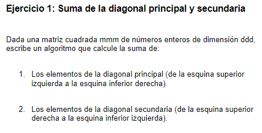

# 1. Formulación del problema

<p align="center">
  
</p>

# 2. Resolución

> I) Entrada del valor de la variable "dimension"
Al iniciar el algoritmo se pedira ingresar un valor para la variable "d", dicho dato sera el n° de filas y n° de columnas de la matriz cuadratica

```bash
 import java.util.Scanner;
```

```bash
    public static void main(String[] args) {
     Scanner sc = new Scanner(System.in);
        System.out.println("Ingresar dimension [d]: ");
        int d = sc.nextInt();
        
        if(d <= 0){
           d = sc.nextInt();;
        }
```
> II) Ingreso de numeros enteros en la matriz 

```bash
    int[] almacenar_sumadiagonal = calcular(d);
```

```bash     
    public static int[] calcular(int d){
    Scanner sc = new Scanner(System.in);      
    int[] almacenar_sumadiagonal = new int[2];
    int[][] Matriz = new int[d][d];
    
    for(int i=0; i < d; i++){
        for(int j=0; j < d;j++){
            System.out.print("["+i+"]"+"[" + j+"]");
            Matriz[i][j] = sc.nextInt();
        }
    }
```    
> III) Impresión y calculo de la sumas diagonales de la matriz

```bash   
    System.out.println("MATRIZ: ");
        
    int k = d - 1;
    for(int i= 0;i < d;i++){
        
        for(int j=0; j < d;j++){
            System.out.print("["+Matriz[i][j]+"]");
            if(j == i){
            almacenar_sumadiagonal[0] += Matriz[i][j];    
            }
            if(j == k){
            almacenar_sumadiagonal[1] += Matriz[i][j];    
            }
            
        }
    System.out.println("");    
    k--;

      
    }
    return almacenar_sumadiagonal;  
    }
```
> IV) Asignación e impresión de salida de los resultados de las sumas diagonales de la matriz dXd

```bash   
        int[] almacenar_sumadiagonal = calcular(d);
        System.out.println("SUMA DIAGONAL IZQUIERDA: " + almacenar_sumadiagonal[0]);
        System.out.println("SUMA DIAGONAL DERECHA: " + almacenar_sumadiagonal[1]);
    }
```

### Codigo completo

```bash
import java.util.Scanner;

    public class Main {

    public static int[] calcular(int d){
    Scanner sc = new Scanner(System.in);    
        
    int[] almacenar_sumadiagonal = new int[2];
    int[][] Matriz = new int[d][d];
    
    for(int i=0; i < d; i++){
        for(int j=0; j < d;j++){
            System.out.print("["+i+"]"+"[" + j+"]");
            Matriz[i][j] = sc.nextInt();
        }
    }
    
    System.out.println("MATRIZ: ");
        
    int k = d - 1;
    for(int i= 0;i < d;i++){
        
        for(int j=0; j < d;j++){
            System.out.print("["+Matriz[i][j]+"]");
            if(j == i){
            almacenar_sumadiagonal[0] += Matriz[i][j];    
            }
            if(j == k){
            almacenar_sumadiagonal[1] += Matriz[i][j];    
            }
            
        }
    System.out.println("");    
    k--;

      
    }
    return almacenar_sumadiagonal;  
    }
    
    public static void main(String[] args) {
     Scanner sc = new Scanner(System.in);
        System.out.println("Ingresar dimension [d]: ");
        int d = sc.nextInt();
        
        if(d <= 0){
           d = sc.nextInt();;
        }
        
        int[] almacenar_sumadiagonal = calcular(d);
        System.out.println("SUMA DIAGONAL IZQUIERDA: " + almacenar_sumadiagonal[0]);
        System.out.println("SUMA DIAGONAL DERECHA: " + almacenar_sumadiagonal[1]);
    }
    
}
```
# 3. Complejidad

> I) Entrada del valor de la variable "dimension"

- Complejidad de tiempo: 𝑂(1)
- Complejidad de espacio: 𝑂(1)

> II) Ingreso de numeros enteros en la matriz 

- Complejidad de tiempo: 𝑂(d²)
- Complejidad de espacio: 𝑂(d²)

> III) Impresión y calculo de la sumas diagonales de la matriz

- Complejidad de tiempo: 𝑂(d²)
- Complejidad de espacio: 𝑂(d²)

> IV) Asignación e impresión de salida de los resultados de las sumas diagonales de la matriz dXd

- Complejidad de tiempo: 𝑂(d²)
- Complejidad de espacio: 𝑂(d²)
